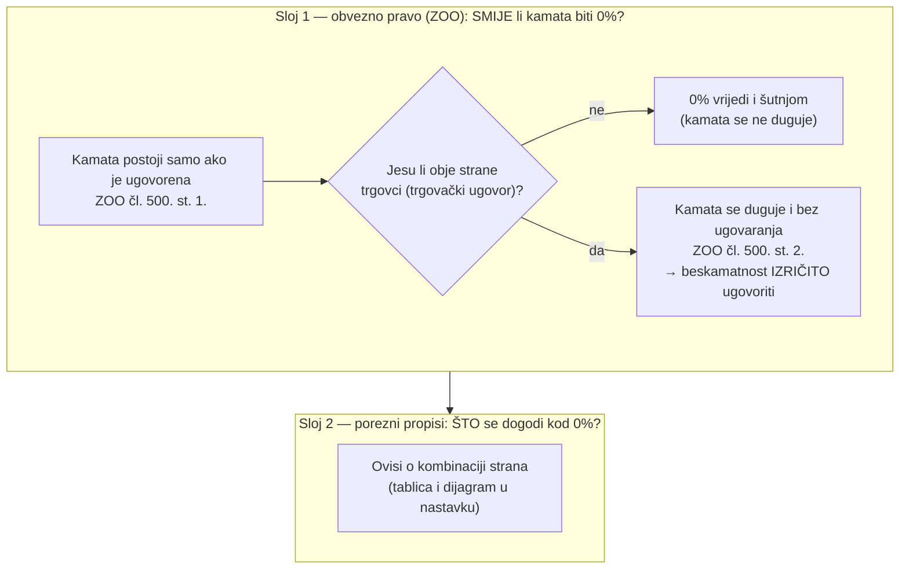
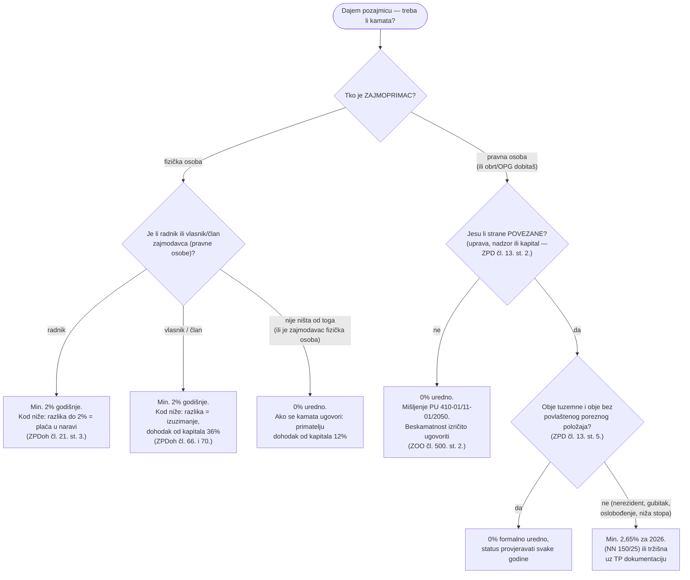
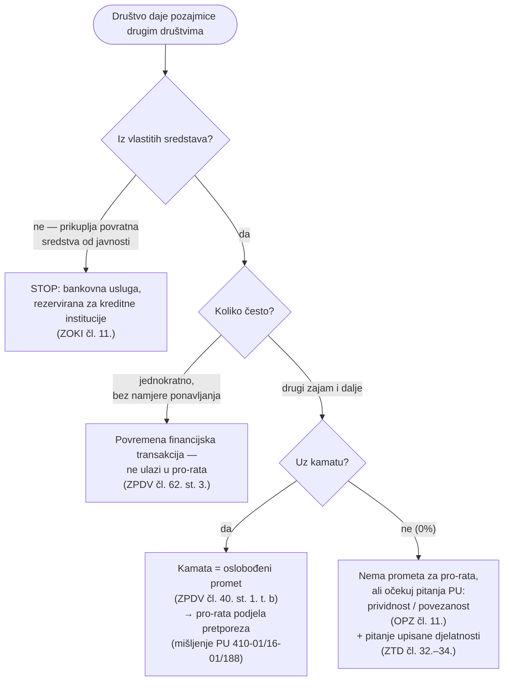
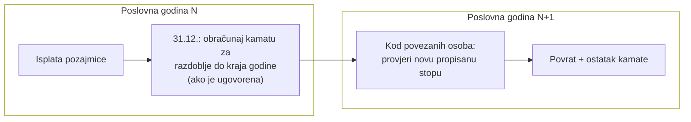

# Pozajmice i kamate u Republici Hrvatskoj — tko kome smije posuditi uz 0 %, a tko mora obračunati kamatu

> **Edukativni članak.** Sve tvrdnje su vezane na članke propisa s poveznicama na Narodne novine
> i na objavljena mišljenja Porezne uprave. **Nije pravni ni porezni savjet** — za konkretan slučaj
> provjerite s odvjetnikom ili poreznim savjetnikom.

| | |
|---|---|
| **Autor** | Matija Stepanić, CEO @ ITalk d.o.o. za informacijske tehnologije, Zagreb, IX. Južna obala 20 (OIB društva: 54872935051, MBS: 081042440) |
| **Kontakt** | ms@italk.hr · stepanic.matija@gmail.com |
| **Izrađeno** | 29.07.2026. u 12:40 (CEST) |
| **Transparentnost** | Istraženo i sastavljeno uz [Claude Code](https://claude.com/claude-code) (Anthropic), model **Claude Fable 5** (`claude-fable-5`). Svi navodi provjereni 29.07.2026. na primarnim izvorima (narodne-novine.nn.hr, zakon.hr, porezna-uprava.gov.hr); autor odgovara za konačni sadržaj. |
| **Verzija** | 1.0 |

---

## TL;DR

1. **Građanskopravno je kamata od 0 % uvijek dopuštena** — kamata na zajam postoji samo ako je
   ugovorena (ZOO čl. 500. st. 1.). „Minimalna zakonska kamata" kao opća obveza **ne postoji**.
2. U **trgovačkim ugovorima** (obje strane trgovci) kamata se duguje i kad nije ugovorena
   (ZOO čl. 500. st. 2.) — pa beskamatnost treba **izričito ugovoriti**, inače zajmoprimac
   kamatu duguje po samom zakonu.
3. Minimumi postoje **samo porezno** i samo za dvije situacije: **2 %** kad pravna osoba
   pozajmljuje svojem radniku ili članu (fizičkoj osobi), **2,65 %** (za 2026.) između
   **povezanih** obveznika poreza na dobit — s time da se za dvije tuzemne „uredne" firme ni to
   ne primjenjuje (ZPD čl. 13. st. 5.).
4. Tvrdnja „između dvije pravne osobe kamata je obavezna" je **netočna** — potvrđeno mišljenjem
   Porezne uprave iz 2011. (v. [§ Mit 1](#mit-1)).
5. Tko pozajmice daje **učestalo**, ulazi u PDV-ovsku priču (oslobođene financijske usluge →
   pro-rata podjela pretporeza), ali time **ne postaje kreditna institucija** — zakonom je
   rezervirano primanje depozita od javnosti, ne kreditiranje vlastitim novcem (v. [§ Mit 2](#mit-2)).
6. Propisa koji bi tražio povrat pozajmice **unutar iste poslovne godine** — nema. Mit dolazi iz
   pravila o **predujmu dobiti** i iz obračunskog priznavanja prihoda od kamata (v. [§ Mit 3](#mit-3)).

---

## 1. Dva odvojena pravna sloja

Kod svake pozajmice treba odvojiti dva pitanja koja se u praksi stalno miješaju:

**Sloj 1 (Zakon o obveznim odnosima):** zajam uređuju čl. 499.–508. ZOO-a. Odgovor je uvijek —
da, smije 0 %. Jedina zamka je čl. 500. st. 2. za trgovačke ugovore (točka 2. TL;DR-a).

**Sloj 2 (porezni propisi):** država nikome ne brani beskamatni zajam, ali u dvije situacije
kod 0 % **pripisuje** nekome prihod ili dohodak i na njega naplaćuje porez. Sve kombinacije su
u nastavku.

## 2. Aktualne stope (2026., drugo polugodište)

| Stopa | Iznos | Osnova |
|---|---:|---|
| Povezane osobe (porez na dobit) | **2,65 %** | ZPD čl. 14. st. 3. + [Odluka, NN 150/25](https://narodne-novine.nn.hr/clanci/sluzbeni/2025_12_150_2236.html) |
| Prag „povoljnije kamate" fizičkim osobama | **2 %** | ZPDoh čl. 21. st. 3. |
| Referentna stopa (ESB, na 1.7.2026.) | 2,40 % | ZOO čl. 29. st. 8. |
| Zatezna — trgovački ugovori | **10,40 %** | ZOO čl. 29. st. 2. (referentna + 8 p. b.) |
| Zatezna — ostali odnosi | **5,40 %** | ZOO čl. 29. st. 2. (referentna + 3 p. b.) |
| **Najviša** ugovorna — barem jedna strana nije trgovac | **8,10 %** | ZOO čl. 26. st. 1. (zatezna + ½) |
| **Najviša** ugovorna — trgovci međusobno | **18,20 %** | ZOO čl. 26. st. 2. (zatezna + ¾) |
| Kamata ugovorena, ali stopa nije određena | 1,35 % / 5,20 % | ZOO čl. 26. st. 3. (¼ odnosno ½ zatezne) |
| Porez na kamate koje primi fizička osoba | **12 %** | ZPDoh čl. 65. i 70. (dohodak od kapitala) |
| Izuzimanja (skrivene isplate dobiti) | **36 %** | ZPDoh čl. 66. i 70. |

Propisana stopa za povezane osobe objavljuje se **svake godine** u Narodnim novinama (odluka
ministra financija, obično u prosincu); zatezne se preračunavaju **1. siječnja i 1. srpnja**.

## 3. Sve kombinacije strana (zajmodavac → zajmoprimac)

| # | Zajmodavac → Zajmoprimac | 0 % bez poreznih posljedica? | Što se dogodi kod 0 % | Min. kamata |
|---|---|---|---|---|
| 1 | Fizička → fizička (obje privatno) | **DA** | Ništa; oprost duga = darovanje (porez na darovanja 4 %, uz oslobođenja za bliske srodnike) | — |
| 2 | Fizička → pravna (nepovezane) | **DA** | Ništa | — |
| 3 | Vlasnik/član (fizička) → svoje društvo | **DA** | Ništa — imputacije nema kad fizička osoba *daje* pogodnost. Ugovori li kamatu: društvu je priznat rashod najviše **2,65 %**; kod udjela ≥ 25 % i zajma > 4× udjela u kapitalu kamata uopće nije priznata (ZPD čl. 8.) | — |
| 4 | Radnik → poslodavac | **DA** | Ništa | — |
| 5 | Pravna → **radniku** | **NE** | Razlika do 2 % = **plaća u naravi** (doprinosi + porez na dohodak, JOPPD) | **2 %** (ZPDoh čl. 21. st. 3.) |
| 6 | Pravna → **vlasniku/članu** (fizičkoj) | **NE** | Razlika do 2 % = **izuzimanje** → dohodak od kapitala **36 %**; bez pisanog ugovora, roka i stvarnog vraćanja rizik prekvalifikacije **cijelog iznosa** u izuzimanje | **2 %** |
| 7 | Pravna → nepovezanoj fizičkoj (nije ni radnik ni član) | **DA** (formalno) | Nema propisane imputacije; oprez kod kreditiranja potrošača kao djelatnosti (ZPK/HANFA) — beskamatni krediti bez naknada izvan su ZPK-a | — |
| 8 | Pravna → pravna, **nepovezane** | **DA** | Ništa — potvrđeno mišljenjem PU iz 2011. (v. § Mit 1); beskamatnost izričito ugovoriti (ZOO čl. 500. st. 2.) | — |
| 9 | Pravna → pravna, povezane, **obje tuzemne, obje „uredne"** (bez gubitka, oslobođenja, niže stope) | **DA** | Pravila o transfernim cijenama ne primjenjuju se (ZPD čl. 13. st. 5.) — ali status provjeravati **svake godine** | — |
| 10 | Pravna → pravna, povezane + **jedna u povlaštenom položaju ili nerezident** | **NE** | Zajmodavcu se imputira prihod (min 2,65 %), zajmoprimcu se rashod priznaje do 2,65 % → korekcije porezne osnovice | **2,65 %** (ili tržišna po TP dokumentaciji, ZPD čl. 14. st. 4.) |
| 11 | Obrt / OPG **„dohodaš"** (bilo koja strana) | kao fizička osoba (redci 1–4) | Nema imputacije iz poreza na dobit; primljene kamate = poslovni primitak, odnosno dohodak od kapitala 12 % privatno | — (prema vlastitim radnicima vrijedi prag 2 %) |
| 12 | Obrt / OPG **„dobitaš"** (obveznik poreza na dobit) | kao pravna osoba (redci 5–10) | Vrijede pravila povezanih osoba i 2 %-tni prag prema radnicima/članovima | 2,65 % ako je povezan + uvjet iz čl. 13. st. 5. |

### Dijagram odluke

---

## 4. Mit 1: „Između dvije pravne osobe kamata je obavezna"

**Netočno.** Ovu tvrdnju knjigovodstva razbija sama Porezna uprava, mišljenjem
**KLASA: 410-01/11-01/2050 od 21.10.2011.** ([sažetak na RRiF-u](https://www.rrif.hr/kamate_na_zajmove_izmedu_nepovezanih_osoba_-1619-misljenje/)):
za zajmove **nepovezanim** rezidentima pravnim osobama **nije propisana obveza** uvećanja porezne
osnovice za neobračunatu kamatu — minimalna stopa iz ZPD čl. 14. odnosi se **samo na povezane
osobe**. Uz dvije ograde iz istog mišljenja:

1. povezanost se gleda **stvarno** (udjeli, uprava, nadzor — ZPD čl. 13. st. 2.), ne po izjavi
   strana, i
2. posao ne smije biti **prividan** (Opći porezni zakon, čl. 11. — oporezuje se prema
   gospodarskoj biti, ne prema formi).

Odakle zabuna? Vjerojatno iz ZOO čl. 500. st. 2.: u trgovačkim ugovorima zajmoprimac kamatu
duguje **i kad nije ugovorena**. To je istina — ali je to **dispozitivna** norma koju strane smiju
isključiti. Knjigovodstvo iz „duguje se po zakonu ako ništa ne piše" izvede „obavezna je", što ne
stoji: dovoljno je u ugovoru izričito isključiti primjenu čl. 500. st. 2. i utvrditi da je zajam
beskamatan.

## 5. Mit 2: „Previše beskamatnih pozajmica → poslujete kao kreditna institucija"

Ovdje je zrno istine umotano u krivi zakon. Redom:

**Što je stvarno rezervirano za banke.** Zakon o kreditnim institucijama
([NN 159/13](https://narodne-novine.nn.hr/clanci/sluzbeni/2013_12_159_3328.html) s izmjenama)
za kreditne institucije rezervira **bankovne usluge**: *primanje depozita ili drugih povratnih
sredstava od javnosti* **i** *odobravanje kredita iz tih sredstava, za svoj račun* (čl. 11.
pročišćenog teksta). Zabranjeno je bez odobrenja **primati depozite od javnosti** — a ne
posuđivati **vlastiti** novac. Trgovačko društvo koje iz vlastitih sredstava daje zajmove drugim
društvima **ne obavlja bankovnu uslugu** i ne treba odobrenje HNB-a. Argument „poslujete kao
kreditna institucija" za davatelja zajmova iz vlastitog džepa nema zakonsko uporište.

**Gdje Porezna ipak ima pravu polugu — PDV.** Davanje kredita i zajmova je financijska usluga
**oslobođena PDV-a** (Zakon o PDV-u,
[NN 73/13](https://narodne-novine.nn.hr/clanci/sluzbeni/2013_06_73_1451.html), čl. 40. st. 1.
t. b). Za oslobođene isporuke **nema odbitka pretporeza** (čl. 58. st. 4.), a obveznik koji radi
i oporezivo i oslobođeno dijeli pretporez **pro-rata** (čl. 62.). „Povremena" financijska
transakcija u taj izračun ne ulazi (čl. 62. st. 3.) — ali mišljenje PU
**KLASA: 410-01/16-01/188 od 26.02.2016.**
([porezna-uprava.gov.hr](https://porezna-uprava.gov.hr/Misljenja/Detaljno/2149)) kaže: povremenom
se smatra **jednokratna** radnja koju obveznik ne namjerava ponavljati; **od drugog zajma nadalje**
kamate ulaze u pro-rata izračun. Tko dakle učestalo daje **kamatonosne** zajmove, faktično obavlja
i oslobođenu financijsku djelatnost i može izgubiti dio odbitka pretporeza. Kod čistih 0 %
zajmova naknade (kamate) nema, pa nema ni oslobođenog prometa koji bi kvario pro-rata — no upravo
učestalost beskamatnog kreditiranja poziva na sljedeću točku.

**Što Porezna smije preispitati kod hrpe beskamatnih pozajmica.** Ne „morate zaračunati kamatu
jer ste banka", nego: jesu li poslovi **prividni** (OPZ čl. 11. — npr. skrivena isplata dobiti,
zaobilaženje oporezivanja izuzimanja) i jesu li strane **stvarno nepovezane**. Ako je sve stvarno
i nepovezano — pravne osnove za imputaciju kamate nema (mišljenje iz § Mit 1). Odvojeno od
poreza, društvo koje kreditiranje pretvori u djelatnost trebalo bi je imati **upisanu u predmet
poslovanja** (ZTD čl. 32.–34.) — s time da su pravni poslovi sklopljeni izvan upisane djelatnosti
**valjani** (ZTD čl. 34.); to je uredska, a ne porezna posljedica.

## 6. Mit 3: „Pozajmica se mora vratiti unutar iste poslovne godine, inače mora ići kamata"

Propis s takvim sadržajem **ne postoji** — ni u ZOO-u, ni u poreznim zakonima nema roka koji bi
b2b pozajmicu vezao uz poslovnu godinu. Rok povrata je stvar ugovora (a bez ugovorenog roka
zajmoprimac vraća tek na zahtjev, uz primjereni rok od najmanje dva mjeseca — ZOO čl. 504.).
Mit se hrani iz tri stvarna pravila koja se krivo generaliziraju:

1. **Predujam dobiti.** Ako član društva tijekom godine primi predujam dobiti veći od stvarno
   ostvarene dobiti, višak mora **vratiti prije podnošenja godišnje prijave** — inače se višak
   oporezuje kao **izuzimanje** (dohodak od kapitala, 36 %; ZPDoh čl. 66. i 70.). U praksi se
   višak zna „pretvoriti" u pozajmicu — a tada, jer je primatelj fizička osoba-član, vrijedi
   minimalna kamata od **2 %** (redak 6 tablice). To je jedino mjesto gdje „kraj godine" stvarno
   pali obvezu kamate — i tiče se **isplata vlasnicima**, ne b2b pozajmica.
2. **Obračunsko priznavanje prihoda.** Ako kamata **jest** ugovorena, prihod od kamata priznaje
   se obračunski, razdoblju na koje se odnosi — pa pozajmica koja prelazi godinu znači obračun
   (i oporezivanje) pripadajuće kamate **u svakoj godini trajanja**, bez obzira na to kada se
   plaća. Kod 0 % nepovezanih nema se što obračunati.
3. **Godišnja stopa za povezane osobe.** Propisana stopa (2,65 % za 2026.) objavljuje se za svaku
   kalendarsku godinu, pa kod višegodišnjih zajmova između povezanih osoba stopu treba **pratiti
   godišnje** (ili dokumentirati vlastitu tržišnu stopu po ZPD čl. 14. st. 4.). Zajam koji
   prelazi godinu nije zabranjen — samo traži ažuriranje obračuna.

## 7. Gornje granice — druga strana medalje

Dok minimume nameće samo porezno pravo, **maksimume** nameće ZOO i oni su prisilni:

- između osoba od kojih **barem jedna nije trgovac**: najviše **zatezna stopa za ostale odnose
  uvećana za polovinu** → trenutno 5,40 % × 1,5 = **8,10 %** (čl. 26. st. 1.);
- **među trgovcima**: najviše **zatezna za trgovačke ugovore uvećana za tri četvrtine** →
  10,40 % × 1,75 = **18,20 %** (čl. 26. st. 2.);
- ugovori li se više — primjenjuje se najviša dopuštena (čl. 26. st. 4.);
- na dospjele, a neplaćene kamate ne teku zatezne kamate (zabrana anatocizma, ZOO čl. 27.),
  osim od dana podnošenja zahtjeva sudu.

## 8. Izvori

### Propisi (Narodne novine)

| Propis | Temeljni broj NN | Ključni članci za ovu temu |
|---|---|---|
| Zakon o obveznim odnosima (ZOO) | [NN 35/05](https://narodne-novine.nn.hr/clanci/sluzbeni/2005_03_35_707.html) (izmjene: 41/08, 125/11, 78/15, 29/18, 126/21, [114/22](https://narodne-novine.nn.hr/clanci/sluzbeni/2022_10_114_1711.html), 156/22, [155/23](https://narodne-novine.nn.hr/clanci/sluzbeni/2023_12_155_2365.html), 69/26) | čl. 26. (najviša ugovorna), čl. 27. (anatocizam), čl. 29. (zatezne), čl. 499.–508. (zajam), čl. 500. (kamata samo ako je ugovorena / trgovački ugovori) — [pročišćeni tekst](https://www.zakon.hr/z/75/Zakon-o-obveznim-odnosima) |
| Zakon o porezu na dobit (ZPD) | [NN 177/04](https://narodne-novine.nn.hr/clanci/sluzbeni/2004_12_177_3067.html) (s izmjenama do 151/25) | čl. 8. (potkapitaliziranost), čl. 13. (povezane osobe; st. 5. tuzemni uvjet), čl. 14. (kamate između povezanih; st. 3. propisana stopa; st. 4. TP metode) — [pročišćeni tekst](https://www.zakon.hr/z/99/zakon-o-porezu-na-dobit) |
| Odluka o objavi kamatne stope na zajmove između povezanih osoba za 2026. | [NN 150/25](https://narodne-novine.nn.hr/clanci/sluzbeni/2025_12_150_2236.html) | stopa **2,65 %**, na snazi od 31.12.2025. |
| Zakon o porezu na dohodak (ZPDoh) | [NN 115/16](https://narodne-novine.nn.hr/clanci/sluzbeni/2016_12_115_2525.html) (s izmjenama) | čl. 21. st. 3. (povoljnija kamata, prag 2 %), čl. 65. (kamate = dohodak od kapitala), čl. 66. (izuzimanja), čl. 70. (stope 12 % / 36 %) — [pročišćeni tekst](https://www.zakon.hr/z/85/zakon-o-porezu-na-dohodak) |
| Zakon o PDV-u (ZPDV) | [NN 73/13](https://narodne-novine.nn.hr/clanci/sluzbeni/2013_06_73_1451.html) (s izmjenama) | čl. 40. st. 1. t. b (oslobođenje zajmova), čl. 58. st. 4. (bez odbitka za oslobođene), čl. 62. (pro-rata; st. 3. povremene transakcije) — [pročišćeni tekst](https://www.zakon.hr/z/1455/zakon-o-porezu-na-dodanu-vrijednost) |
| Zakon o kreditnim institucijama (ZOKI) | [NN 159/13](https://narodne-novine.nn.hr/clanci/sluzbeni/2013_12_159_3328.html) (s izmjenama) | čl. 11. pročišćenog teksta (bankovne usluge; zabrana primanja depozita od javnosti) — [pročišćeni tekst](https://www.zakon.hr/z/195/Zakon-o-kreditnim-institucijama) |
| Zakon o trgovačkim društvima (ZTD) | [NN 111/93](https://narodne-novine.nn.hr/clanci/sluzbeni/1993_12_111_2133.html) (s izmjenama) | čl. 32.–34. (predmet poslovanja; valjanost poslova izvan djelatnosti) — [pročišćeni tekst](https://www.zakon.hr/z/546/zakon-o-trgovackim-drustvima) |
| Opći porezni zakon (OPZ) | [pročišćeni tekst](https://www.zakon.hr/z/100/Op%C4%87i-porezni-zakon) | čl. 11. (gospodarski pristup, prividni poslovi) |

### Mišljenja Porezne uprave

- **KLASA: 410-01/11-01/2050, 21.10.2011.** — kamate na zajmove između **nepovezanih** osoba:
  nema obveze obračuna ([RRiF](https://www.rrif.hr/kamate_na_zajmove_izmedu_nepovezanih_osoba_-1619-misljenje/))
- **KLASA: 410-01/16-01/188, 26.02.2016.** — povremene financijske transakcije i pro-rata:
  od **drugog zajma** kamate ulaze u izračun ([Porezna uprava](https://porezna-uprava.gov.hr/Misljenja/Detaljno/2149))

### Stručni pregledi stopa

- [TEB — Kamate prema poreznim propisima u 2026.](https://www.teb.hr/novosti/2025/kamate-prema-poreznim-propisima-u-2026-godini/)
- [TEB — Zatezne i ugovorne kamate od 1.7.2026. do 31.12.2026.](https://www.teb.hr/novosti/2026/zatezne-i-ugovorne-kamate-od-172026-do-31122026/)
- [Porezna uprava — dohodak od kapitala po osnovi izuzimanja](https://porezna-uprava.gov.hr/hr/dohodak-od-kapitala-po-osnovi-izuzimanja-imovine-i-koristenja-usluga/4652)
